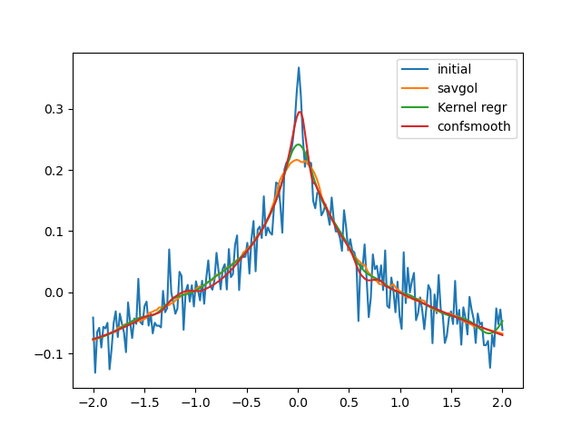

# Confidence Based Smoothing
The algorithm smooths functions preserving local peaks. To distinguish peaks from noise it needs noise standard deviation. 



## Installation

pip install --upgrade confsmooth

## Usage

```python
import os, shutil, statsmodels
import matplotlib.pyplot as plt
import numpy as np
from statsmodels.nonparametric.kernel_regression import KernelReg
from confsmooth import confsmooth
from scipy.signal import savgol_filter

x = np.linspace(-2,2,500)
real_noise_level = 0.002
y = 1 - np.power(np.abs(x)+0.01,0.01) + np.random.normal(0, real_noise_level, len(x))

# estimate noise standard deviation
savgol = savgol_filter(y,21,1)
noise_level = np.std(y - savgol)
print('Estimated noise level =', noise_level, 'Real noise level =', real_noise_level)

smoothed_conf = confsmooth(y, noise_level, confidence=0.995, deg=2)

kr = KernelReg(endog=y, exog=x, var_type='c', bw=[0.1])
smoothed_kr, _ = kr.fit(x)

fig,ax = plt.subplots()
ax.plot(x, y, label='initial')
ax.plot(x, savgol, label='savgol')
ax.plot(x, smoothed_kr, label='Kernel regr')
ax.plot(x, smoothed_conf, label='confsmooth')
ax.legend()
plt.show()
```
